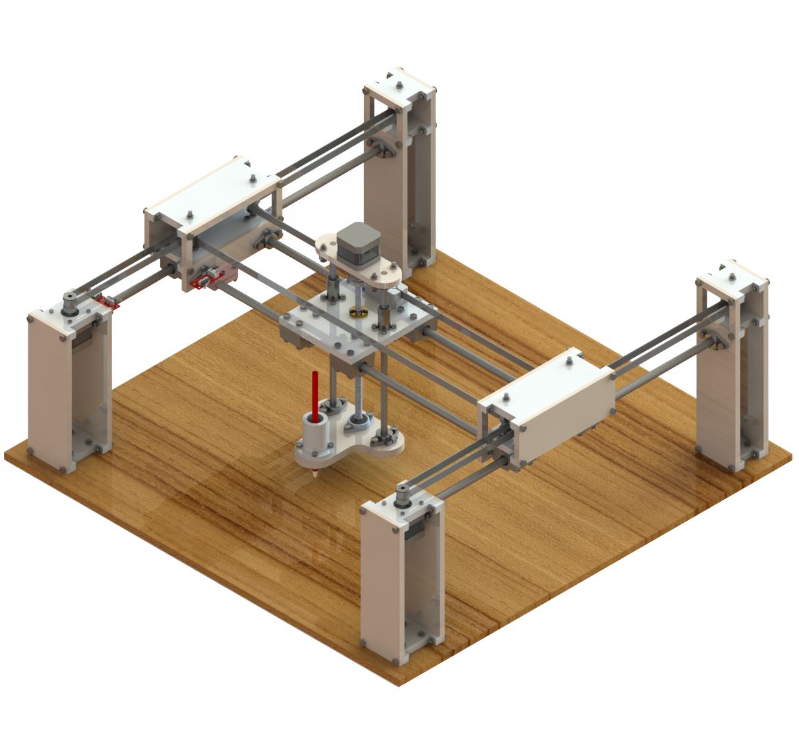
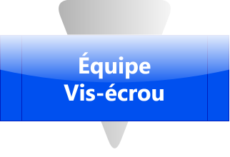

# Système Cartésien - Interface WebSerial

*[Accès à l'interface statique déployée](https://samy-y.github.io/projet2_groupe14)*

 

Ce dépôt contient le code source développé par l'équipe du deuxième projet d'ingénierie spécialisée dans le développement d'un traceur de plan cartésien avec solution vis-écrou pour translation selon Z.

## Contexte

Ce projet de système cartésien à trois degrés de libertés, dont le but final est d'agir en tant que traceur de plan, a été développé dans le cadre du deuxième projet d'ingénierie de la première année du cycle préparatoire de l'EMINES (CPI-1A). La variante sur laquelle notre équipe de 22 personnes a travaillé dispose d'une solution vis-écrou pour la translation selon l'axe Z.

> Originellement, ce dépôt contenait le code source de l'interface de pilotage développée par le **Groupe 14 - Class2030 (UM6P-EMINES)** pour un traceur de plans cartésien H-Bot. Il a été rendu commun dans le cadre de la préparation au forum.

Nous tenons à saluer notre collaboration fructueuse, qui a permis à l'équipe *Vis-Écrou*  de faire aboutir ce projet de traceur. Les membres de l'équipe sont :

<table>
  <thead>
    <tr>
      <th align="center">Groupe</th>
      <th>Membres</th>
    </tr>
  </thead>
  <tbody>
    <tr>
      <td rowspan="3" align="center">5</td>
      <td>Rayane Ayad</td>
    </tr>
    <tr>
      <td>Mohamed Boudkhameth</td>
    </tr>
    <tr>
      <td>Douae Rhabri</td>
    </tr>
    <tr>
      <td rowspan="3" align="center">6</td>
      <td>Mohamed El Korchi</td>
    </tr>
    <tr>
      <td>Zakaria Ennamous</td>
    </tr>
    <tr>
      <td>Moutaa Jemali</td>
    </tr>
    <tr>
      <td rowspan="3" align="center">8</td>
      <td>Akram Boumazlague</td>
    </tr>
    <tr>
      <td>Sara El Badssi</td>
    </tr>
    <tr>
      <td>Jad El Hammoumi</td>
    </tr>
    <tr>
      <td rowspan="3" align="center">10</td>
      <td>Aya El Briki</td>
    </tr>
    <tr>
      <td>Abdellah Rahmouni</td>
    </tr>
    <tr>
      <td>Oussama Zair</td>
    </tr>
    <tr>
      <td rowspan="3" align="center">11</td>
      <td>Amine Id Hamou</td>
    </tr>
    <tr>
      <td>Nor-Iddine Ouaarab</td>
    </tr>
    <tr>
      <td>Arij Zahi</td>
    </tr>
    <tr>
      <td rowspan="3" align="center">12</td>
      <td>Walid Ait Elgrif</td>
    </tr>
    <tr>
      <td>Soukaina Ennouni</td>
    </tr>
    <tr>
      <td>Ayoub Khlifi</td>
    </tr>
    <tr>
      <td rowspan="4" align="center">
        14 
      </td>
      <td>Soufiane Bourghel</td>
    </tr>
    <tr>
      <td>Boughrara Riham</td>
    </tr>
    <tr>
      <td>Rita Tamma</td>
    </tr>
    <tr>
      <td>Samy Youssoufine</td>
    </tr>
  </tbody>
</table>

## Structure du Dépôt Principal

### Code embarqué

| Fichier | Description |
|---------|-------------|
| `SYSTEME_CARTESIEN.ino` | Micrologiciel du traceur, implémente la gestion des mouvements via DDA en entiers et la communication série |

### Interface Web

| Fichier | Description |
|---------|-------------|
| `index.html` | Évident (unique page statique principale) |
| `app.js` | Logique de la machine à états (IDLE, HOMING, RUNNING, ERROR), communication série |
| `styles.css` | Design frontend "flat" avec aspect mécanique |

Les assets graphiques (images &c) sont stockés dans le dossier `assets/`.

### Documentation

| Fichier | Description |
|---------|-------------|
| `mkdocs.yml` | Configuration du site MkDocs |
| `docs/index.md` | Documentation du projet |
| `INSTALL.md` | Guide d'installation et de déploiement GitHub Pages |

### Expériences

Le code utilisé lors des expériences réalisées sur la machine (ou ses composants) est stocké dans le dossier `/Expériences`.

| Dossier | Description |
|-|-|
| `/Expériences/Expérience à vide/` | Code relatif à l'expérience réalisée sur les moteurs à vide pour quantifier les vibrations via accéléromètre. Rejetée. |
| `/Expériences/Expérience sur montage/` | Code (et documentation) relatif à l'expérience réalisée sur le montage final, pour déterminer la fréquence propre de vibration de la structure finale et assemblée. |

*Projet 2 (CPI-1A).*
